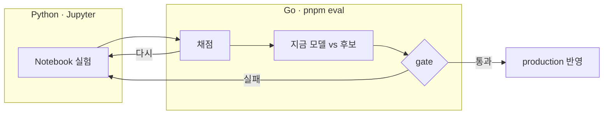

# snapdone

사진과 스크린샷을 넣으면 무엇을 하려던 것인지 알아채고, 그 일을 대신 끝내주는 앱.

## 구조

| 위치          | 스택                       |
| ------------- | -------------------------- |
| `apps/web`    | Next.js 16 (App Router)    |
| `apps/mobile` | Expo SDK 56 + React Native |
| `apps/api`    | Go                         |
| `libs/`       | web · mobile 공유 계약     |
| `tools/`      | 개발 도구                  |

Nx가 작업 orchestration을 담당한다.

## 시작하기

필요한 것: Node 24.14.0 (`.nvmrc`), pnpm 10.30.3, Go 1.26.6

lint · format · tsconfig 설정은 GitHub Packages의 `@berrypjh/*` 패키지에서 온다. **토큰이 없으면 `pnpm install`이 401로 실패한다.**

```bash
export GITHUB_TOKEN=<read:packages 권한이 있는 PAT>

nvm use
pnpm install

cp apps/web/.env.example apps/web/.env.local
cp apps/mobile/.env.example apps/mobile/.env
```

각 앱은 별도 터미널에서 띄운다.

```bash
pnpm dev:web      # http://localhost:3000
pnpm dev:api      # http://127.0.0.1:8080
pnpm dev:mobile   # Expo (Metro)
pnpm dev:devhub    # DevHub (내부 도구) http://localhost:3100
```

`pnpm dev`는 web · api · devhub를 함께 띄운다. mobile은 대화형 프로세스라 따로 실행한다.

api는 Postgres(`DATABASE_URL`)와 마이그레이션이 있어야 기동한다. 순서는 [local-development.md](docs/development/local-development.md#로컬-postgres).

## 검증

```bash
pnpm verify   # format:check -> lint -> typecheck -> test -> test:hooks -> build
```

개별 실행은 `pnpm lint`, `pnpm typecheck`, `pnpm test`, `pnpm build`.

```bash
pnpm e2e      # Playwright (브라우저 필요, verify에 미포함)
pnpm health   # API 연결 확인 (개발자용)
pnpm graph    # Nx project graph
```

E2E를 처음 돌리기 전에 브라우저를 한 번 받아야 한다.

```bash
pnpm exec playwright install chromium firefox webkit
```

## 모델 평가 — 실험에서 production까지

모델 하나를 notebook에서 실험해 production 분류기에 넣기까지의 순서다.



| 단계                                                                                | 하는 일                                            |
| ----------------------------------------------------------------------------------- | -------------------------------------------------- |
| [Notebook 실험](tools/evals/lab/notebooks/classification/02_prompt_model_lab.ipynb) | 지시문 · 모델을 dev case 몇 개에 시험한다          |
| [채점](apps/api/internal/evaluation)                                                | 원시 답을 Go가 채점한다                            |
| [지금 모델 vs 후보](tools/evals/experiments)                                        | 후보를 Go 설정으로 적고 같은 run에서 나란히 돌린다 |
| [gate](tools/evals/gates)                                                           | 통과 여부를 판정하고 DevHub에서 본다               |
| [production 반영](apps/api/internal/processing/result.go)                           | 모델 · 지시문을 PR로 바꾼다                        |

### 준비

![uv][uv] ![Python 3.12+][python]

```bash
pnpm eval:lab:setup   # 한 번만. tools/evals/lab/.venv 생성
pnpm eval:lab         # JupyterLab
```

<details>
<summary>VS Code에서 열 때</summary>

커널을 한 번 등록한다.

```bash
tools/evals/lab/.venv/bin/python -m ipykernel install --user --name snapdone-eval-lab --display-name "snapdone eval lab"
```

**Select Kernel → Select Another Kernel → Jupyter Kernel... → `snapdone eval lab`**

</details>

dataset은 `tools/evals/lab/notebooks/`의 `00_dataset_overview.ipynb` → `classification/01_eda.ipynb`로 살핀다.

### Notebook 실험

`classification/02_prompt_model_lab.ipynb` 맨 위 변수를 고친다.

| 변수                 | 무엇                                                      |
| -------------------- | --------------------------------------------------------- |
| `PROVIDER` · `MODEL` | 시험할 공급자와 모델 id                                   |
| `PROMPT`             | 지시문. 파일(`load_prompt(...)`)이나 문자열               |
| `CASE_LIMIT`         | 부를 case 수 = 유료 호출 상한                             |
| `RUN`                | `True`면 실제로 부른다. key는 커널을 띄운 환경에서 읽는다 |
| `EXPERIMENT_ID`      | 내보낼 파일 이름과 variant id                             |

> [!WARNING]
> `RUN = True`는 유료 호출이다. 처음에는 `False`로 끝까지 돌려 본다.

원시 답과 분포를 보고 지시문 · 모델을 바꿔 다시 돌린다. 마음에 들면 마지막 cell이 `lab/out/<EXPERIMENT_ID>.{jsonl,json}`을 쓰고 replay 명령을 출력한다.

### 채점

```bash
pnpm eval replay --dataset sample-classification --split dev \
  --variant tools/evals/lab/out/<experiment>.json \
  --predictions tools/evals/lab/out/<experiment>.jsonl --run-id <experiment>
```

결과는 `tools/evals/results/<experiment>/`. 남길 예측은 `tools/evals/predictions/`로 옮겨 커밋한다. 임계값을 보려면 이 run을 `classification/03_gate_lab.ipynb`에서 연다.

### 지금 모델 vs 후보

후보를 Go 설정으로 적는다.

- **모델만 바꾸면** 파일이 필요 없다 — `--variant anthropic:<model>`
- **지시문을 바꾸면** `tools/evals/experiments/prompts/<name>.md`에 지시문을 두고, `facts-prompt.json`을 복사해 `experiments/<name>.json`의 `id` · `promptPath`를 바꾼다 → `--variant <name>@anthropic:<model>`
- **임계값을 바꾸면** `experiments/cascade.json`처럼 `cascade.escalateOn`에 적는다 → `--variant cascade@anthropic:<먼저 답할 모델>,<다시 물을 모델>`

지금 production 설정(`PROCESSING_MODEL`과 기본 지시문)을 기준선으로 같은 run에 넣는다. 그래야 같은 case로 비교된다.

```bash
V="--variant anthropic:<지금 모델> --variant <name>@anthropic:<후보 모델>"
pnpm eval plan --dataset <dataset> $V                                        # 호출 수 확인, 호출 0
pnpm eval run  --dataset <dataset> $V --allow-api --max-api-calls N --run-id <run>
```

### gate

```bash
pnpm eval compare --baseline <run>:<지금 모델> --candidate <run>:<후보 variant id> \
  --gate tools/evals/gates/<name>.json --comparison-id <name>
```

variant id는 `summary.md`에 있다(모델만이면 모델 이름, 실험 설정이면 `<name>-<모델>`). 규칙 파일은 `gates/example.json`을 복사해 만든다. 종료 코드 4면 실패이고 판정은 `results/comparisons/<name>/comparison.json`에 있다. `pnpm dev:devhub` → `/evals`에서 같은 결과를 본다.

통과한 후보는 같은 비교를 `--split validation`으로 한 번 더 돌리고, 마지막에 `--split held-out --allow-held-out`으로 한 번 돌린다.

> [!IMPORTANT]
> held-out 결과를 보고 지시문 · dataset을 고치지 않는다.

### production 반영

> [!NOTE]
> 사람이 결정하고 PR로 바꾼다.

| 바꾼 것 | 고칠 곳                                                                                                                |
| ------- | ---------------------------------------------------------------------------------------------------------------------- |
| 모델    | 배포 환경의 `PROCESSING_PROVIDER` · `PROCESSING_MODEL`(필요하면 `PROCESSING_BASE_URL`). 예시는 `apps/api/.env.example` |
| 지시문  | `apps/api/internal/processing/result.go`의 `instructions`에 `prompts/<name>.md` 내용을 옮긴다                          |
| 임계값  | production 분류기에는 계단식이 아직 없다. 별도 코드 작업이다                                                           |

지시문을 옮긴 뒤 `pnpm nx run api:test`로 확인하고, [지금 모델 vs 후보](#지금-모델-vs-후보)를 기본 지시문(`anthropic:<모델>`)으로 한 번 더 돌려 후보와 같은 결과인지 본다.

[python]: https://img.shields.io/badge/Python-3.12%2B-3776AB?style=flat-square&logo=python&logoColor=white
[uv]: https://img.shields.io/badge/uv-DE5FE9?style=flat-square&logo=uv&logoColor=white
